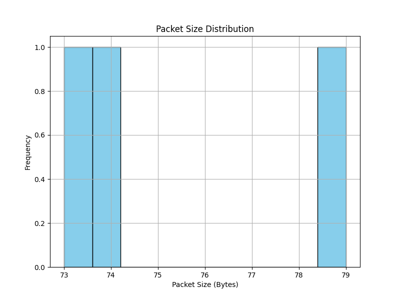
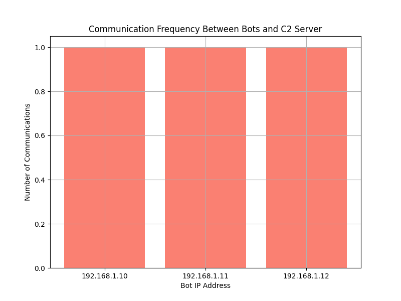
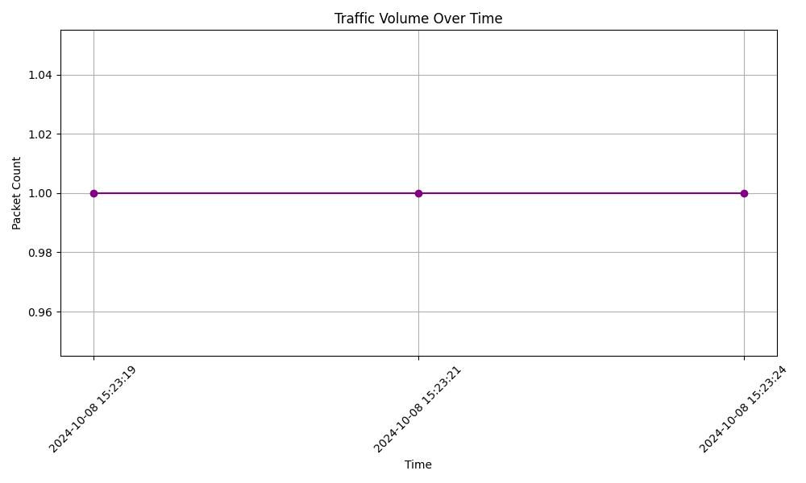

# Phase 2: Network Traffic Analysis

## Overview
In Phase 2, the goal was to analyze the simulated botnet traffic from Phase 1 and extract key patterns that can be used to improve botnet detection methods. We successfully pre-processed the captured traffic, extracted meaningful features, and visualized the traffic patterns, which provided insights into the botnet's communication with the C2 server.

### Key Tasks:
1. **Pre-process the Captured Traffic (traffic_analysis.py)**:
   - We used the Wireshark-captured network traffic from Phase 1 as input.
   - The following key features were extracted:
     - **Packet size**: Packet size distribution allowed us to see the data volume and trends in communication.
     - **Protocol type**: All communications used the TCP protocol.
     - **Time intervals between packets**: Time intervals helped track the frequency and timing of bot communications.
     - **Frequency of C&C requests**: Frequency of communications between the bots and the C2 server was tracked to understand botnet behavior.

2. **Feature Extraction (feature_extraction.py)**:
   - We processed the data to identify key traffic features, including:
     - **Packet size distribution**: The extracted packet sizes showed how much data was being transferred per communication.
     - **Communication frequency between bots and the C2 server**: Each bot communicated with the C2 server exactly once, with no further communication recorded in this simulation.
     - **Traffic volume over time**: The total traffic volume was low and consistent over time, without significant spikes.

3. **Traffic Pattern Identification and Visualization (traffic_visualization.py)**:
   - We visualized the traffic patterns using **Matplotlib**, generating the following graphs:
     - **Packet Size Distribution**: Showed a uniform distribution of packet sizes between 73 and 79 bytes.
     - **Communication Frequency**: All three bots communicated once with the C2 server, and no bot communicated more frequently than another.
     - **Traffic Volume Over Time**: Showed a steady traffic pattern without fluctuations, indicating consistent communication without high traffic bursts.

### Key Insights:
- **Packet Size Distribution**: The uniformity in packet sizes suggests that the bots sent similar-sized commands to the C2 server.
  - 
  
- **Communication Frequency**: Each bot communicated with the C2 server exactly once, reflecting a low-level botnet simulation with consistent C&C behavior.
  - 
  
- **Traffic Volume Over Time**: There was no noticeable spike in traffic volume, which suggests that the traffic was evenly distributed over time without major bursts.
  - 

### Deliverables:
- **traffic_analysis.py**: Script for parsing and pre-processing the traffic data.
- **feature_extraction.py**: Script for extracting meaningful traffic features.
- **traffic_visualization.py**: Script for visualizing the traffic patterns.
- **Traffic graphs**:
  - packet_size_distribution.png
  - cnc_request_frequency.png
  - traffic_volume_over_time.png
  - All stored in `/results/` as `.png` files.
