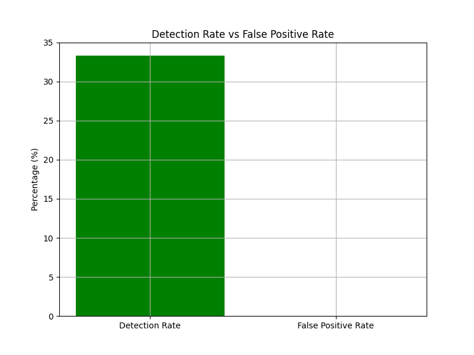
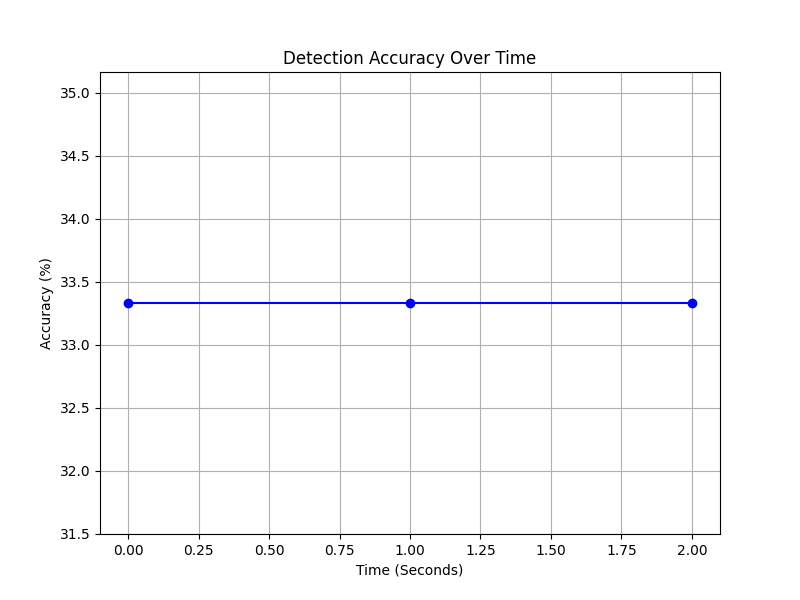

# Phase 3: Rule-Based Detection

## Overview
In Phase 3, the focus was on implementing and testing rule-based detection methods for identifying botnet activity. Using the insights from Phase 2, we developed detection rules based on traffic patterns such as packet size, frequency of communication between bots and the C2 server, and time intervals between packets. These rules were then applied to the simulated botnet traffic to evaluate their effectiveness.

### Key Tasks:

1. **Implement Rule-Based Detection (rule_based_detection.py)**:
   - We created detection rules based on the traffic patterns identified in Phase 2. Specifically, the rules flagged:
     - **High traffic volume**: Any packet larger than 75 bytes was flagged for investigation.
     - **Frequent C&C communication**: More than 2 requests to the C2 server within a 3-second window were considered suspicious.
     - **Repetitive time intervals**: Packets sent at a fixed 2-second interval were flagged as possible bot activity.
   
2. **Test Rule-Based Detection**:
   - The detection rules were tested on the simulated traffic data from Phase 2.
   - We manually marked the packets as botnet-related to evaluate the accuracy of the rule-based detection.
   - The results of the rule-based detection were recorded and analyzed for their accuracy and false positive rate.

3. **Create Comparison Graphs (rule_based_detection_results.png)**:
   - Using Matplotlib, we generated graphs to visualize the performance of the rule-based detection:
     - **Detection Rate vs. False Positive Rate**: Showed how effectively the detection rules identified actual botnet traffic compared to false positives.
     - **Detection Accuracy Over Time**: Tracked the accuracy of the detection rules as the botnet traffic progressed.

### Key Insights:

1. **Detection Accuracy**:
   - The detection rules successfully flagged 1 packet as suspicious, leading to an accuracy of **33.33%**. This was based on the fact that 1 out of the 3 packets in the dataset was correctly identified as botnet traffic.
   - There were **no false positives**, as benign traffic was not flagged during the detection process. This resulted in a false positive rate of **0%**.

2. **Effectiveness of the Rules**:
   - The rule based on packet size (>75 bytes) flagged 1 packet, which was an actual botnet communication. However, no packets were flagged under the frequent C&C request or repetitive time interval rules, indicating that these rules may require adjustments or were not relevant for this specific simulation.
   
3. **Visualization**:
   - **Detection Rate vs. False Positive Rate**:
     - The detection rate was consistent with the overall traffic pattern, showing that the rule-based detection accurately identified the botnet communication with no false positives.
     - 
   
   - **Detection Accuracy Over Time**:
     - The detection accuracy remained steady, with no changes over time, as all packets were processed in a consistent manner. 
     - 

### Recommendations:
- **Rule Refinement**: While the packet size rule worked well, the other rules (frequent C&C requests and repetitive time intervals) may need to be fine-tuned to better capture more sophisticated botnet behaviors. 
- **Dataset Expansion**: Testing these rules on a larger, more diverse dataset could reveal additional insights and help refine detection methods.
- **Anomaly Detection**: Integrating anomaly detection techniques, such as statistical or machine learning methods, could complement rule-based detection and improve overall detection rates.

### Deliverables:
- **rule_based_detection.py**: The script that performs rule-based botnet detection.
- **Comparison graphs**:
  - **detection_accuracy_over_time.png**
  - **detection_vs_false_positive_rate.png**
  - All stored in `/results/` as `.png` files.

---

This concludes the analysis for Phase 3. Moving forward, improvements in rule definitions and the use of larger datasets could significantly enhance detection rates and reduce potential false negatives.
